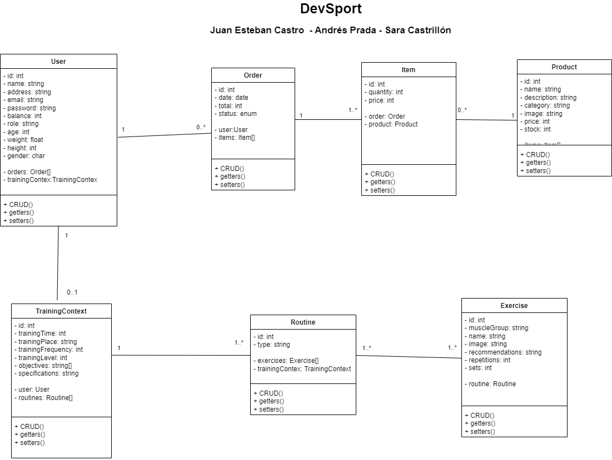

# DevSport:



## 1. Installation

Version: [Laravel 10](https://laravel.com/)

Requirements:

- XAMPP: [XAMPP](https://www.apachefriends.org/download.html) is the most popular PHP development enviroment. Is an Apache distribution containg MySQL, PHP, and Perl. 
- Composer: Is a tool for dependency managment in PHP.

After you have installed PHP and Composer, you may create a new Laravel project via Composer's create-project command:

```
composer create-project laravel/laravel online_store
```

## 2. Run the project:

```
cd online_store 
php artisan serve 
```